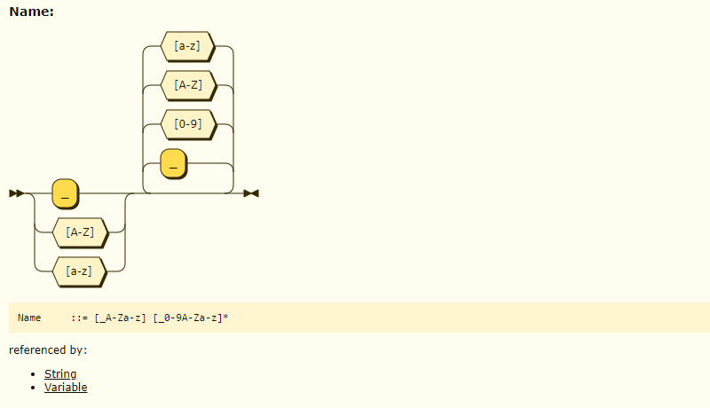
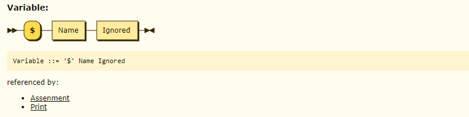
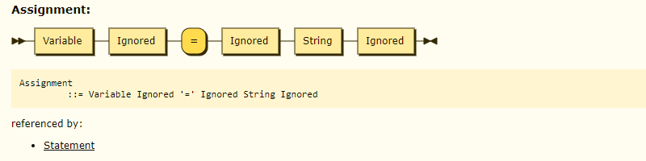

牙医教你 450 行代码自制编程语言 - 1, 从 EBNF 开始.md
-------------------------------------------------

@version    20210102:1  
@author     karminski <work.karminski@outlook.com>  


打算新开个读书专栏, 主要写一些我读过的书的读书笔记和理解分享给大家. 本篇是其中的第一篇, 图书是《自己动手实现Lua: 虚拟机, 编译器和标准库》:

- [《自己动手实现Lua：虚拟机、编译器和标准库》](https://union-click.jd.com/jdc?e=jdext-1331174943460048896-0&p=AyIGZRhfEQAUAlEZWBAyEgZUGF4SAhIFUBJaEQQiQwpDBUoyS0IQWhkeHAxfEE8HCllHGAdFBwsCEwZWHlwVAhACXBpfEx1LQglGa2lVWnpcTwhRYXZHBkIzFXRIXT1jGHUOHjdVElsXChMGVRxYJQITBlUfXhYBFAZlK1sQMlNpXBhdFAUaN1QrWxICEwdRHFIXCxYPUitbHQYi0fuPjp29y7fwzfG715%2B3gJLwwbyUN2UrWCVZR1McXkcVABAHVR1eHQcQAlIaWhALGw9SB1olAhMGVx9ZFAUaBzseWxQDEwNdGlkXbBAGVBlaFAAVAVYrWyUBIlk7GggVUhVVAEw1T1lTBxAeWxdsEgRdHFwRBBA3VxpaFwA%3D)

没有系统学习过编译原理的同学可能会很好奇编程语言的编译器, Lexer & Parser, 虚拟机是怎么实现的. 而又苦于系统性的教材过于枯燥.  

那么其实本书作为系统学习编译原理的预热, 我觉得是非常适合的. 即使并不准备系统性的学习, 看完此书后, 也能对编译原理有个很不错的理解.  

就这本书而言, 作者 张秀宏 利用 Go 语言实现了一个 Lua 虚拟机. 其代码简洁凝练, 非常易于学习.   

这里我并不打算详细介绍这本书的内容, 反而我想利用这本书的内容给大家演示一下, 实现一个最简单的编程语言.  

太长的教程作为例子不是很好, 所以我只用 450 行 Go 代码就完成了这个例子, 请看:


# 从 EBNF 开始

我们来实现一个最简单的编程语言, 就叫 [pineapple](https://github.com/karminski/pineapple) 好了 (代码可以从 [https://github.com/karminski/pineapple](https://github.com/karminski/pineapple) 下载). 它只有 450 行代码, 这个语言甚至都不是图灵完备的, 但作为演示已经足够了.  

这个语言的功能只有给变量赋值, 然后打印变量, 类似这样:

```php
$a = "pen pineapple apple pen."
print($a)
```

然后它会打印:

```php
pen pineapple apple pen.
```

是不是很简单? 没错, 接下来我们就要实现它.  

我们从 EBNF 开始, 下面的东西也许你看不懂, 没关系, 你马上就能看懂了!: 

```ebnf
SourceCharacter ::=  #x0009 | #x000A | #x000D | [#x0020-#xFFFF] /* /[\u0009\u000A\u000D\u0020-\uFFFF]/ */
Name            ::= [_A-Za-z][_0-9A-Za-z]*
StringCharacter ::= SourceCharacter - '"'
String          ::= '"' '"' Ignored | '"' StringCharacter '"' Ignored
Variable        ::= "$" Name Ignored
Assignment      ::= Variable Ignored "=" Ignored String Ignored
Print           ::= "print" "(" Ignored Variable Ignored ")" Ignored
Statement       ::= Print | Assignment
SourceCode      ::= Statement+ 
```

简单来讲, EBNF (Extended Backus–Naur form, 扩展巴科斯范式) 是一种描述语法的语言, 相当于编程语言语法的蓝图, 有了它, 我们就可以轻松实现一门语言的词法和语法解析器.  


## 我们先来看第一行, SourceCharacter:

```ebnf
SourceCharacter ::=  #x0009 | #x000A | #x000D | [#x0020-#xFFFF] /* /[\u0009\u000A\u000D\u0020-\uFFFF]/ */
```
这代表了, SourceCharacter 这个表达式 可以是 Unicode #x0009 或 #x000A 或 #x000D 或 #x0020-#xFFFF 这个范围. 这基本是可用字符串范围. 如果你看不懂, 没关系, 我们也不会这么去实现, 就大概知道是大部分的 Unicode 就可以了.

EBNF 定义可以生成语法图, 看起来是这样子的:


这图是从左向右的流程, 从左侧的双箭头开始, 每条分支代表都可以走的流程路线. 最后到右侧相对的箭头结束.

## 然后再来看 Name 表达式:

```ebnf
Name ::= [_A-Za-z][_0-9A-Za-z]*
```

这代表了, Name 这个表达式开头由下划线 ```_``` 或大小写字母 ```A-Za-z``` 构成, 熟悉正则表达式的同学立刻就会看懂. 然后后面由下划线, 大小写字母, 数字构成 ```_0-9A-Za-z```, 最后的 ```*``` 代表这些可以有0或多个. (名称不能以数字为开头, 一部分原因其实是为了规避词法解析中与数字冲突的问题, 因为数字是用数字开头的, 如果不是数字的类型也用数字开头, 那么解析器的实现就会变得相当复杂)    

  

从左向右, 每条分支都代表可以构成的路径. 语法图很好地图形化了我们的 EBNF 定义.  
注意连接到中间的横线上的分支部分, 有的是向内闭合的, 有的是向外闭合的, 向内闭合代表这可以循环, 即 ```*```, 向外闭合则代表只能出现一次.  


## 接下来是 StringCharacter 表达式:

```ebnf
StringCharacter ::= SourceCharacter - '"'
```

这里的 ```- '"'``` 代表不包含双引号 ```"```, 即 StringCharacter 是 SourceCharacter 但不包含双引号. (String 要用双引号作为结束/闭合的标记)  


## 同样 String:    

```ebnf
String ::= '"' '"' Ignored | '"' StringCharacter '"' Ignored
```   

  


代表了 ```String``` 表达式由空字符串 ``` "" Ignored ``` (双引号里面是空的) 或不包含双引号的字符串 ```"StringCharacter" Ignored``` 构成. ```|``` 代表或, Ignored 代表可忽略的字符, 比如空格, tab, 换行, 注释等.   


## 然后是 Variable 表达式:

```ebnf
Variable ::= "$" Name Ignored
```

  


是不是已经能看懂了? 没错, Variable 由一个美元符号 $ 和 Name 表达式构成. 


## Assignment 表达式也很简单:

```ebnf
Assignment  ::= Variable Ignored "=" Ignored String Ignored
```

  


前面是 Variable, 然后跟着等号 ```=```, 后面是 String. 中间有 Ignored 则代表, 可以用空格等将这些元素分开.


## 最后剩下的 Print, Statement, SourceCode:  

```ebnf
Print       ::= "print" "(" Ignored Variable Ignored ")" Ignored
Statement   ::= Print | Assignment
SourceCode  ::= Statement+ 
```

  


Print 语句由 ```print```, 左圆括号 ```(```, Variable, 右圆括号 ```)``` 组成.

Statement 代表语法中的所有语句, 我们只有 Print 和 Assignment 是合法语句.  

最后用 SourceCode 来封装 Statement, ```+``` 代表 SourceCode 里面可以有多个语句.

到这里, 我们就完成了 pineapple 语言的 EBNF 定义, 也了解了这门语言的语法.  

## 告一段落

第一篇就到这里结束啦, 第二篇我们会教大家构建 Lexer (词法解析器). 敬请期待~

