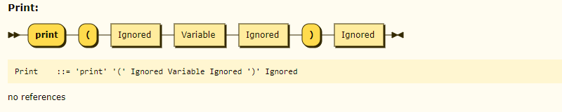
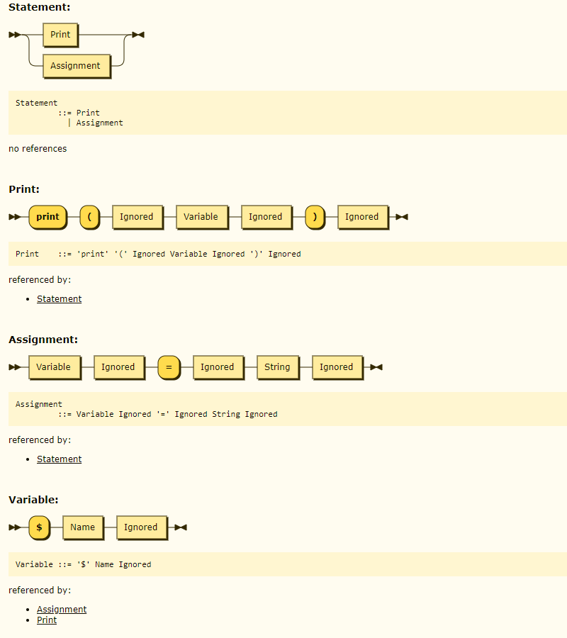

牙医教你 450 行代码自制编程语言 - 2, 两个魔法就可以实现永动机.md
------------------------------------------------------------

@version    20210103:1  
@author     karminski <work.karminski@outlook.com>  


上篇  [牙医教你 450 行代码自制编程语言 - 1, 从 EBNF 开始](https://zhuanlan.zhihu.com/p/341405385), 我们简单演示了一门编程语言的语法设计, 以及 EBNF 是如何使用的. 现在我们已经有了名为 EBNF 的蓝图, 就可以开始写词法分析器 (Lexer) 了.  

本教程的所有代码都可以在 [https://github.com/karminski/pineapple](https://github.com/karminski/pineapple) 找到.  

另外, 再次推荐这本书, 本教程就是类似这本书的简化版本, 想要仔细学习的话可以考虑看原作:  

- [《自己动手实现Lua：虚拟机、编译器和标准库》](https://union-click.jd.com/jdc?e=jdext-1331174943460048896-0&p=AyIGZRhfEQAUAlEZWBAyEgZUGF4SAhIFUBJaEQQiQwpDBUoyS0IQWhkeHAxfEE8HCllHGAdFBwsCEwZWHlwVAhACXBpfEx1LQglGa2lVWnpcTwhRYXZHBkIzFXRIXT1jGHUOHjdVElsXChMGVRxYJQITBlUfXhYBFAZlK1sQMlNpXBhdFAUaN1QrWxICEwdRHFIXCxYPUitbHQYi0fuPjp29y7fwzfG715%2B3gJLwwbyUN2UrWCVZR1McXkcVABAHVR1eHQcQAlIaWhALGw9SB1olAhMGVx9ZFAUaBzseWxQDEwNdGlkXbBAGVBlaFAAVAVYrWyUBIlk7GggVUhVVAEw1T1lTBxAeWxdsEgRdHFwRBBA3VxpaFwA%3D)


# Lexer (词法分析器)

且慢, 啥是词法分析器?   

简单来讲, 词法分析器就是将源代码解析成 EBNF 中定义的最小元素 (也叫 Token) 的过程. 比如如下 EBNF 定义 (看不懂的同学可以复习下上篇教程[从 EBNF 开始](https://zhuanlan.zhihu.com/p/341405385) ):

```ebnf
IntPrefix ::= "int"
```

这里的 ```int``` 不可再分且是固定的, 就是 Token. 我们的目的就是先将所有代码解析成不可再分的最小元素 Token 的过程. (当然, 本文的 Token, 语句, 表达式等定义很不精确, 想要详细了解的话可以看教材. 我们为了简便, 不会过于纠结这些定义.)  

# 定义 Token  

我们仍然把上篇的 EBNF 定义放在这里:  

```ebnf
SourceCharacter ::=  #x0009 | #x000A | #x000D | [#x0020-#xFFFF] 
Name            ::= [_A-Za-z][_0-9A-Za-z]*
StringCharacter ::= SourceCharacter - '"'
String          ::= '"' '"' Ignored | '"' StringCharacter '"' Ignored
Variable        ::= "$" Name Ignored
Assignment      ::= Variable Ignored "=" Ignored String Ignored
Print           ::= "print" "(" Ignored Variable Ignored ")" Ignored
Statement       ::= Print | Assignment
SourceCode      ::= Statement+ 
```

然后我们开始定义 Token:

```go
const (
    TOKEN_EOF         = iota  // end-of-file
    TOKEN_VAR_PREFIX          // $
    TOKEN_LEFT_PAREN          // (
    TOKEN_RIGHT_PAREN         // )
    TOKEN_EQUAL 			  // =
    TOKEN_QUOTE         	  // "
    TOKEN_DUOQUOTE 			  // ""
    TOKEN_NAME                // Name ::= [_A-Za-z][_0-9A-Za-z]*
    TOKEN_PRINT               // print                
)
```

可以看到我们定义了一堆常量, 包括变量的前缀 ```$```, 包裹函数参数的括号 ```(``` ```)```, 甚至还有函数名称 ```print```.   

这里有一些特殊的 Token, 比如 ```TOKEN_EOF```, 这个 Token 用于标记代码的结束. 检测到这个 Token, 就不会继续解析下去了.  

另外还有 ```TOKEN_DUOQUOTE```, 两个双引号 ```""```, 代表空字符串. 这里为了简化处理, 我们直接在 Lexer 阶段直接把空字符串当成 Token 来处理了. 这样可以简化后续逻辑. 算是个小技巧.  

最后还能看到, 说了需要写 **将所有代码解析成不可再分的最小元素**, 所以有 ```TOKEN_NAME```, 但是为什么没有代表 ```SourceCharacter``` 的 ```TOKEN_SOURCE_CHARACTER``` 呢?   

这是因为 ```SourceCharacter``` 的范围实在是太大了, 每个字符都去按照范围去匹配的话, 会影响性能, 因此我们采用另外的方式去匹配 ```SourceCharacter```, 一会大家就能看到了.  


# 然后需要造一个永动机  

等会, 刚才还计算机科学呢, 现在怎么就突然切换到民科了?  

这里的永动机其实要说的是自动机, 编程语言的 Lexer 就是其中的一种. 我们并不会讲解自动机理论, 所以放松心情, 看我们来造两个神奇的函数:  

```go
func NextTokenIs(token int) (tokenName string) {} 
func LookAhead() (token int) {}
```

其中 ```NextTokenIs()``` 函数用于断言下一个 Token 是什么, 比如 ```NextTokenIs(TOKEN_VAR_PREFIX)```, 我们断言下一个 Token 必然是 ```$```, 如果不是, 就证明输入的代码出语法错误了.  

而 ```LookAhead()``` 没有参数, 但执行它的时候, 他会 LookAhead (向前看) 一个 Token, 告诉我们下一个 Token 是什么.  

也许你会问, 这俩函数有什么用呢? 来, 我们要开始咏唱魔法了!  

我们现在定义如下 EBNF:  

```ebnf
Print ::= "print" "(" Ignored Variable Ignored ")" Ignored
```



没错, 我们之前定义的 Print 语句. 它的开头必须是 ```print``` 这个字符串, 我们已经定义好了 Token: ```TOKEN_PRINT```.  

现在我们直接快进到 Parser, 为了解析 Print 语句, 我们可以这么写:  


```go

func parsePrint() {
    // "print"
    NextTokenIs(TOKEN_PRINT)
    ...
}

```

很简单对不对? 一旦解析 Print 的语法的时候, 我们就断言, Print 开头必须是 ```TOKEN_PRINT``` (即 ```"print"```).  

那么举一反三, 接下来是左括号 ```(```, 然后是变量的语句 ```Variable```, 最后是右括号 ```)```. 那么就可以写成:  


```go
// Print ::= "print" "(" Ignored Variable Ignored ")" Ignored
func parsePrint() {
    // "print"
    NextTokenIs(TOKEN_PRINT)     
    // "(" 
    NextTokenIs(TOKEN_LEFT_PAREN) 
    // Variable
    parseVariable()
    // ")"
    NextTokenIs(TOKEN_RIGHT_PAREN)
}
```

是不是有一种渐渐的明白了什么的感觉? 对! 如果遇到了 Token 就直接断言 Token (```NextTokenIs(...)```), 如果遇到了语句, 就调用**解析这个语句的函数** (```parseXXXX()```).  

这样, 不断地递归调用, 就完成了整个编程语言的 **Parser** (语法解析器)! 而这个解析器就叫做**递归下降解析器** (因为是按照 EBNF 从最开始的语句一直解析到最小的 Token, 这个过程是递归下降的, 所以叫递归下降解析器).  

如果是你手写的, 不是机器生成的, 就叫 **手写递归下降解析器** 啦, 没错, 这个过程可以机器自动完成, 但为了给大家详细讲解, 我们并没有用 Flex/Bison 等自动化代码生成器 (大部分教材都用这个, 结果大家看得云里雾里很难受), 而是选择了手写.   

等会, 那 ```LookAhead()``` 是用来干什么的呢?  

看这个例子:  

```ebnf
Statement       ::= Print | Assignment
Print           ::= "print" "(" Ignored Variable Ignored ")" Ignored
Assignment      ::= Variable Ignored "=" Ignored String Ignored
Variable        ::= "$" Name Ignored
...
```




这次我们要解析 Statement, 我们可以看到 Statement 可以是 Print 或 Assignment. 那怎么判断究竟是哪个呢? 可以这样:  


```go
func parseStatement() () {
    switch LookAhead() {
    // "print" 
    case TOKEN_PRINT:
        return parsePrint()
    // "$"
    case TOKEN_VAR_PREFIX:
        return parseAssignment()
    default:
        return nil, errors.New("parseStatement(): unknown Statement.")
    }
}
```

我们先用了 ```LookAhead()``` 来看看下一个  Token 是什么, 如果是 ```TOKEN_PRINT``` ("print"), 那么肯定就是 ```Print``` 语句了! 我们就调用 ```parsePrint()```.  

如果是 ```TOKEN_VAR_PREFIX``` ("$"), 那么就是 ```Assignment``` 了! 因为 ```Assignment``` 的第一个元素是 ```Variable```, ```Variable``` 的第一个元素正好是 "$" (```TOKEN_VAR_PREFIX```). 是不是再次理解了什么是递归下降?   

好了, 太长估计大家也消化不了, 所以每次的文章我会控制在 4000 字左右. 那么, 本篇告一段落. 我们下篇就要实现这两个重要的函数了. 祝你身体健康, 再见.  


