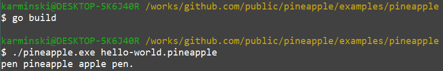

牙医教你 450 行代码自制编程语言 - 6, 后端.md
-----------------------------------------

@version    20210105:1  
@author     karminski <work.karminski@outlook.com>


上一篇  [牙医教你 450 行代码自制编程语言 -5, 递归下降语法解析器](), 我们终于完成了编译器前端, 本篇我们就来讲编译器后端怎么实现.  

本教程的所有代码都可以在 [https://github.com/karminski/pineapple](https://github.com/karminski/pineapple) 找到.  


再次推荐这本书, 本教程就是类似这本书的简化版本, 想要仔细学习的话可以考虑看原作:  

# 我们的目的是什么? 

回想一下, 我们的这门语言是这样的:  

```php
$a = "pen pineapple apple pen."
print($a)
```

把一个字符串变量赋值, 然后打印出来. 由于上下文只有这一层, 因此变量的存储很简单, 我们给它存到一个大 map 里面, 需要的时候去查找就好了.  

```go
type GlobalVariables struct {
    Variables  map[string]string
}

func NewGlobalVariables() *GlobalVariables {
    var g GlobalVariables
    g.Variables = make(map[string]string)
    return &g
}
```

定义的 ```GlobalVariables``` 里面装了个 ```map[string]string``` 结构. 变量名称作为索引, 变量值作为值就搞定了.  

```NewGlobalVariables``` 则作为全局变量存储的初始化方法.  

# 执行!  

接下来我们就编写执行代码的本体函数:  

```go
func Execute(code string) {
    var ast *SourceCode
    var err  error 

    g := NewGlobalVariables()

    // parse
    if ast, err = parse(code); err != nil {
        panic(err)
    }

    // resolve
    if err = resolveAST(g, ast); err != nil {
        panic(err)
    }
}
```

首先这个函数需要传入 ```code```, 即源代码. 然后交给 ```Parser```, 执行 ```parser```. 这样就得到了 AST (抽象语法树). AST 是这个样子的:  

```
(*pineapple.SourceCode)({
    LineNum: (int) 1,
    Statements: ([]pineapple.Statement) (len=2 cap=2) {
        (*pineapple.Assignment)({
            LineNum: (int) 1,
            Variable: (*pineapple.Variable)({
                LineNum: (int) 1,
                Name: (string) (len=1) "a"
            }),
            String: (string) (len=24) "pen pineapple apple pen."
        }),
        (*pineapple.Print)({
            LineNum: (int) 2,
            Variable: (*pineapple.Variable)({
                LineNum: (int) 3,
                Name: (string) (len=1) "a"
            })
        })
    }
})
```

有了这个语法树的蓝图, 我们接下来就可以编写相关的 resolve 方法了. 

# 解析 AST 

首先我们看到 AST 的顶层就是 ```*pineapple.SourceCode``` 而我们之前 EBNF 的定义 ```SourceCode ::= Statement+```, 它是由多个 ```Statement``` 构成的. 我们也可以看到, 的确是这样: ``` Statements: ([]pineapple.Statement) (len=2 cap=2) ```.  

我们仍然用类似递归下降的思路去完成解析器:  

```go
func resolveAST(g *GlobalVariables, ast *SourceCode) error {
    if len(ast.Statements) == 0 {
        return errors.New("resolveAST(): no code to execute, please check your input.")
    }
    for _, statement := range ast.Statements {
        if err := resolveStatement(g, statement); err != nil {
            return err
        }
    }
    return nil
}
```
遍历 ```ast.Statements``` 然后将得到的 ```statement``` 交给后续的 ```resolveStatement``` 方法就可以了.  

# 解析 Statement

同样, ```Statement``` 是由两种类型 ```*Print``` 和 ```*Assignment``` 构成的, 那么我们这样做:  

```go
func resolveStatement(g *GlobalVariables, statement Statement) error {
    if assignment, ok := statement.(*Assignment); ok {
        return resolveAssignment(g, assignment)
    } else if print, ok := statement.(*Print); ok {
        return resolvePrint(g, print)
    } else {
        return errors.New("resolveStatement(): undefined statement type.")
    }
}
```

我们直接对传入的 ```statement``` 进行断言, 如果是 ```*Assignment``` 那就执行 ```resolveAssignment()```, 如果是 ```*Print```, 那就执行 ```resolvePrint()```. 是不是简单极了!  

# 解析 Assignment

Assignment 是给变量赋值的过程. 而我们已经定义好了装变量的全局变量表 ```GlobalVariables```.  只要装进去就行了:  

```go
func resolveAssignment(g *GlobalVariables, assignment *Assignment) error {
    varName := "" 
    if varName = assignment.Variable.Name; varName == "" {
        return errors.New("resolveAssignment(): variable name can NOT be empty.")
    }
    g.Variables[varName] = assignment.String
    return nil
}
```

这里判断变量名是否不为空, 如果不为空, 那就装进去 ```g.Variables[varName] = assignment.String```.  

# 解析 Print 

Assignment 是给变量赋值的过程. 而 Print 是打印变量的过程, 那么很容易就推断出, 实现方法就是在全局变量表找到目标变量, 然后打印出它的值就行了:  

```go
func resolvePrint(g *GlobalVariables, print *Print) error {
    varName := ""
    if varName = print.Variable.Name; varName == "" {
        return errors.New("resolvePrint(): variable name can NOT be empty.")
    }
    str := ""
    ok  := false
    if str, ok = g.Variables[varName]; !ok {
        return errors.New(fmt.Sprintf("resolvePrint(): variable '$%s'not found.", varName))
    }
    fmt.Print(str)
    return nil
}
```

查找 ```str, ok = g.Variables[varName]```, 打印 ```fmt.Print(str)```. 秒杀~  

# 还缺点什么?  

当然, 我们还却一个入口文件:  

```go
package main 

import (
    "os"
    "fmt"
    "io/ioutil"
    "github.com/karminski/pineapple/src"
)

func main() {

    // read file
    args := os.Args
    if len(args) != 2 {
        fmt.Printf("Usage: %s filename\n", args[0])
        return
    }
    filename := args[1]
    code, err := ioutil.ReadFile(filename)
    if err != nil {
        fmt.Printf("Error reading file: %s\n", filename)
        return
    }

    // execute
    pineapple.Execute(string(code))

}
```

读取文件, 然后执行代码 ```pineapple.Execute(string(code))``` 就可以了!  

激动人心的时刻:  




恭喜你! 到此为止, 你已经简单掌握了**编译器前端**和一个**解释器后端**的编写方法了! 感兴趣的同学可以 fork 这个项目, 试试给它添加你想要的功能, 比如实现字符串拼接, 实现数值类型变量, 实现四则运算, 甚至实现函数! 这样一个真正图灵完备的语言就实现了!  

当然, 如果你遇到了问题, 这本书是你最好的朋友.  


