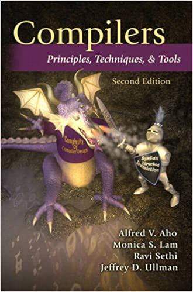

牙医教你 450 行代码自制编程语言 - 7, 后续该如何学习编译原理.md
-----------------------------------------

@version    20210105:1  
@author     karminski <work.karminski@outlook.com>

上一篇  [牙医教你 450 行代码自制编程语言 - 6, 后端](), 我们终于完成了整个编译器, 本篇则是一点点的经验分享, 讲一讲该如何系统学习编译原理.  

本教程的所有代码都可以在 [https://github.com/karminski/pineapple](https://github.com/karminski/pineapple) 找到.  

# Why

有同学会问, 学这玩意真的不是屠龙之术么? 答案是不是的. 编译原理在很多工程实践中都可以用得到. 我来举几个例子:  

我刚开始工作的时候, 是在 [so.com](https://so.com), 360 搜索工作. 当时要收录一些新闻, 我想做一个正文抽取工具. 我的一个思路就是, 分析 HTML 中的元素, 然后判断其中哪个元素视觉面积最大, 那肯定就是正文了.  

而想要实现这一点, 需要一个 HTML 和 CSS 的 Parser, 然后还要有个后端去解析语法树, 找到视觉面积最大的节点.  

当然, 这个项目最后是用 NLP 做的, 因为用 NLP 很成熟. 我的想法遇到的最大问题是, 并不一定视觉元素最大的就是正文. 但这个思路本身提供了一种新的正文抽取的可能性. 作为未来的研究是非常不错的. 比如, 如果它的正文面积不够大, 我们就认为是垃圾文章. 做一个页面排版评分器. 又或者作为一种轻量化的无头浏览器 (Headless Brwoser) 去完成其他工作.   

**学习新技术并不单只是去应用, 去完成业务. 更重要的是给你一个更高的视角, 让你知道会有超脱于传统的, 更有效的, 更高效率的方法, 让你去了解业界的变革和方向. 这也是不断学习的意义与价值.**

好的, 例子就举这么多, 那么该怎样去学习呢?

# How  

首先如果你喜欢看视频的话, 可以直接去 B 站看上面的编译原理相关课程. 上面我粗略看了一眼, 国内比较好的大学的编译原理视频课程都有. 可以放心看.  

我主要推荐的是书籍, 而且写作这个专栏的目的也是为了推荐一些我觉得非常棒的书籍和书单. 相对于视频, 书籍更好翻阅和查找, 并且能更快速地学习. 视频的优点在于有讲解, 而随着你的学习深入, 总有一天你会遇到没有相关视频, 只有相关书籍的情况, 这时候没有很好的看书自学能力, 就很难继续学习下去了.   

第一本仍然推荐我最推荐的 张秀宏 写的这本《自己动手实现Lua：虚拟机、编译器和标准库》. 如果说 2020 年我看过的最好的书, 那么第二名就是它了. 它从 0 开始 用 Go 语言实现了一个真正可用的 Lua 虚拟机. 它的实现非常凝练, 代码易于理解. 本系列教程也是根据这本书的的思想写作而成. 但这本书注重实现一个 Lua 虚拟机, 而没有系统的讲解编译原理需要的知识, 而且它实现的是个解释器, 因此编译器最难的代码生成部分, 并没有介绍. 所以后续学习还要看别的书.  

- [《自己动手实现Lua：虚拟机、编译器和标准库》](https://union-click.jd.com/jdc?e=jdext-1331174943460048896-0&p=AyIGZRhfEQAUAlEZWBAyEgZUGF4SAhIFUBJaEQQiQwpDBUoyS0IQWhkeHAxfEE8HCllHGAdFBwsCEwZWHlwVAhACXBpfEx1LQglGa2lVWnpcTwhRYXZHBkIzFXRIXT1jGHUOHjdVElsXChMGVRxYJQITBlUfXhYBFAZlK1sQMlNpXBhdFAUaN1QrWxICEwdRHFIXCxYPUitbHQYi0fuPjp29y7fwzfG715%2B3gJLwwbyUN2UrWCVZR1McXkcVABAHVR1eHQcQAlIaWhALGw9SB1olAhMGVx9ZFAUaBzseWxQDEwNdGlkXbBAGVBlaFAAVAVYrWyUBIlk7GggVUhVVAEw1T1lTBxAeWxdsEgRdHFwRBBA3VxpaFwA%3D)

第二本则是你想系统的学习编译原理推荐的书 《编译器设计(第2版)》. 这本书的优点在于, 它相比传统经典的"龙书", "虎书", 出版时间比较晚, 因此内容也比较新. 而且内容分配我认为也比较合理. 是我最推荐的系统学习编译原理的书籍. 

- [《编译器设计(第2版)》](https://union-click.jd.com/jdc?e=jdext-1331174982441615360-0&p=AyIGZRprFQISAlMYXBcyVlgNRQQlW1dCFFlQCxxKQgFHRE5XDVULR0UVAhICUxhcFx1LQglGa0hZEXxTRCJeYG5xKk4HcmZtdVJbX0MOHjdVElsXChMGVRxYJQITBlUfXhYBFAZlK1sQMkRpVRpaFAMTAlEcXCUDIgdSG1oVBhUOUB1TFAciB10fa8OshtLdpIKlp8St%2B87WpdebrIGl3SUyIgRlQA5BS1cbVRlZFQIUAl0SWBAHEgBVH1kSAw4GZRtaFAAWBVQcUxVsFwdUGloRChMFV3VZFAMQBlQZXBMBIgdlGGtLbBNXBUldFQERaQ9AGhVHQQEGdVsWChUCUhNfJQATBlcZ)

第三本是著名的虎书《现代编译原理 C语言描述》. 这本书其实当你有了一定的编译原理知识后, 作为一个索引是很不错的, 它比这些系统讲解编译原理的书都薄 (不到400页). 因此一些细节不是很翔实. 另外有些同学觉得难受的是, 这本书本来是用 ML 语言写的, 这本 C语言描述 (还有 Java 语言描述), 看起来更像 ML 移植的, 看起来不舒服. 我倒觉得只当作索引就还好啦, 真的用它来实现相关代码没什么必要.  

另外, 它之所以叫"虎书", 是因为原书封面是个老虎:  

- [《现代编译原理 C语言描述》](https://union-click.jd.com/jdc?e=jdext-1331175015840808960-0&p=AyIGZRprFQEQAlceWxAyVlgNRQQlW1dCFFlQCxxKQgFHRE5XDVULR0UVARACVx5bEB1LQglGaxJmaH0JbxJ%2BZxZ5I0gAUwJtbAtOCFMOHjdVElsXChMGVRxYJQITBlUfXhYBFAZlK1sQMkRpVRpaFAMTAlEcXCUDIgdSG1oVBhUOUR9SEwUiB10fa8OshtLdpIKlp8St%2B87WpdebrIGl3SUyIgRlQA5BS1cbVRlZFQIUA1QbXxwHEw5UElMSAw4GZRtaFAAWBVQcUxVsFwdUGloRChMFV3VZFAMQBlQZXBMBIgdlGGtLbBNUVkgPQAUaaQ9AGhVHS1UMdVsWCxsCXB1fJQATBlcZ)

第四本果然还是龙书《编译原理(第2版)》. 这本书是国内很多高校的教材. 大家普遍反映它的前端部分写得非常棒. 但是后端部分缺乏现代化的内容 (这本书是2006年出版的). 因此后端的内容可以结合其他书去阅读.  

这本书叫龙书当然也是因为它的封面有龙... 

顺便, 这本书的最新第三版也出版了, 不过还没有中文翻译版.  

- [《编译原理(第2版)》](https://union-click.jd.com/jdc?e=jdext-1331175067289092096-0&p=AyIGZRprFQMTA1wdXRIyVlgNRQQlW1dCFFlQCxxKQgFHRE5XDVULR0UVAxMDXB1dEh1LQglGa1B3WUcPQFxIYFJbPGcdZgNgTgd5IXUOHjdVElsXChMGVRxYJQITBlUfXhYBFAZlK1sQMkRpVRpaFAMTAlQfWCUDIgdSG1oVBhUOUhJbFgMiB10fa8OshtLdpIKlp8St%2B87WpdebrIGl3SUyIgRlQA5BS1cbVRlZFQIUA1QcXRYLGgZdGFodBQ4GZRtaFAAWBVQcUxVsFwdUGloRChMFV3VZFAMQBlQZXBMBIgdlGGtLbBNUVUtSQQAWaQ9AGhVHUkJTdVsWChUAVxJaJQATBlcZ)

第五本那就是鲸书《高级编译器设计与实现》. 这本书全是讲 IR 和后端优化的, 如果你有志从事编译器相关工作, 那么还是需要看一看的.  

当然, 这本书叫鲸书是因为原书封面是鲸鱼张大的嘴, 我觉得是比较抽象了...

- [《高级编译器设计与实现》](https://union-click.jd.com/jdc?e=jdext-1331175143709192192-0&p=AyIGZRhYHAAUAlIfXhQyFQ5dHVoQBxoGVxNrUV1KWQorAlBHU0VeBUVNR0ZbSkAOClBMW0scUh0EEwJQE1oXCg1eEEcGJWltWAAYBUVmcUMJThB8akJ0HnsjRXIeC2UbUhUAGgZUG1wWMhIGVBtfEAERAVQraxUHIkY7G1oXBBEBXRxrFDISAFUaWxEFGw5SGV4SMhIPUSuNu5bHj%2BrC67DUuKmAluvAi7nT651rJTIRNw5OD1xHDgdXGVsVBBYHUBldFAoSD1YbUxYeEzdVGloXBhAGUhNbewcSBlQaXx0DEAU7GVoUABMGVxxdFjISN1YrBXsDQQQGTF8cBHxdDlpbUQdVVDsbWBwLFARVHWsXAxMFVw%3D%3D)

然后是《垃圾回收的算法与实现》. 这本书主要是讲 GC 的. 对 GC 感兴趣的朋友可以看一看, 普通作为阅读的话, 我觉得掌握三色标记就可以面试的时候跟面试官稍微讲一下了.  

- [《垃圾回收的算法与实现》](https://union-click.jd.com/jdc?e=jdext-1331175236469866496-0&p=AyIGZRhfEQAUAlEZWBAyEgZUGF4QChoAVBxTEgYiQwpDBUoyS0IQWhkeHAxfEE8HCllHGAdFBwsCEwZWHl4dChUGUhNcER1LQglGa0FhZEc0YCJdZ0odJhldXlsRRVxEJ3UOHjdVElsXChMGVRxYJQITBlUfXhYBFAZlK1sQMlNpXBhdFAUaN1QrWxICEwdRHFMUCxcAVCtbHQYi0fuPjp29y7fwzfG715%2B3gJLwwbyUN2UrWCVZR1McXkcVABAHVR1fFgAVAlITUhIFFw9SB1olAhMGVx9ZFAUaBzseWxQDEwNdGlkXbBAGVBlaFAAVAVYrWyUBIlk7GggVUhtTVx01T1lTBxFGEk5sEgRdH1ITABs3VxpaFwA%3D)

最后, 这本书什么时候都可以读, 只要你学习计算机科学, 那这本书就跑不了了. 《深入理解计算机系统(原书第3版)》.  

如果你没有计算机的基础知识, 那么这本书很可能每一页都会震撼到你.  

什么是进程?什么是线程?  

什么是CPU上下文?  

并发和并行的区别是什么?  

CPU是怎么运算数据的?  

编译器都做了些什么?  

L1/L2 cache 有什么用?  

什么是物理地址?页表有什么用?  

malloc函数是怎么实现的?  

什么是锁?什么是信号量?  

这本 CSAPP (Computer Systems: A Programmer's Perspective) 会给你最好的解答.

- [《深入理解计算机系统(原书第3版)》](https://union-click.jd.com/jdc?e=jdext-1331175309718888448-0&p=AyIGZRprFQETBlIcWRMyVlgNRQQlW1dCFFlQCxxKQgFHRE5XDVULR0UVARMGUhxZEx1LQglGa2lLU1MQGQtRYWcACU4Gd1xkcCd4AXUOHjdVElsXChMGVRxYJQITBlUfXhYBFAZlK1sQMkRpVRpaFAMTAlQfWCUDIgdSG1oVBhUPVh9TFgYiB10fa8OshtLdpIKlp8St%2B87WpdebrIGl3SUyIgRlQA5BS1cbVRlZFQIUA1caUxMCGw5cEl4QCw4GZRtaFAAWBVQcUxVsFwdUGloRChMFV3VZFAMQBlQZXBMBIgdlGGtLbBNUVUhdHAIaaQ9AGhVGWVMLdVsWChUBVB1SJQATBlcZ)

# End

当然, 我并不是专业工作于编译器领域的, 所以更深入的学习还需要各位自己去探索. 这一系列文章如果能激起一个人学习编译原理的兴趣, 哪怕有一个人看了看我的例子, 哪怕有一个人实现了一个简单的编译器, 便是我最大的欣慰了.  

书山有路勤为径. 各位共勉.  
